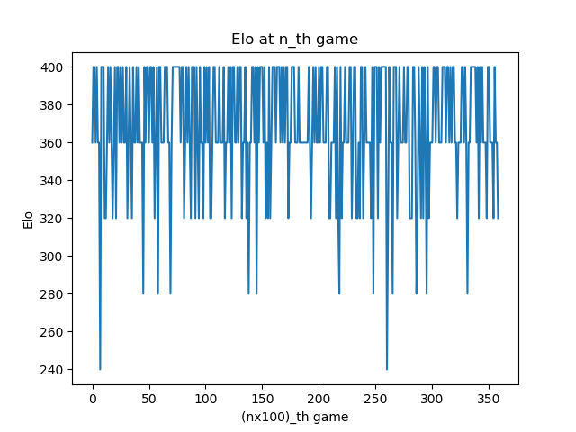

# AI_Chess

This project is to train an agent that can play chess vs human players by using the reinfocement learning.

# Reinforcement Learning
The reinforcement learning is simply a table of states and actions, where its value is the reward for a specific state with associating action. Below is the example of a Q-matrix used in the reinforcement learning method.

## Encoding a board

We  encode  a  board  as  a  Forsyth-Edwards  Notation  (FEN) string. An  example  of  a board in FEN is:  `rnbqkbnr/pp1ppppp/8/2p5/4P3/5N2/PPPP1PPP/RNBQKB1R b Kkqe3  1  2`.   The  algebraic  notation  is  used  to  define  cells  and  moves  in  a  board.   It  uses  acoordinate system to identify a specific cell from the board

## Q-Matrix
The Q-Matrix will be a dictionary that have the keys as boards (states) and values as moves with their own score (actions). It will store all possible states and update existing states.
An example of a Q-Matrix element: `{'rnbqkbnr/pp1ppppp/8/2p5/4P3/5N2/PPPP1PPP/RNBQKB1R b Kkq e3 1 2': {'c5c4':0},…}`

## Algorithm
We initialize the agent with learning rate is 0.1,  = 0.9. We will repeat following steps until the game ends:
1. Finding all possible actions (moves) for the current state (board).
2. If the current state is not in the Q-Matrix or the mutation is occurring in this state, choose a random action from all possible actions above and perform it. Otherwise, the agent will perform the move having the most score in those possible actions. 
3. We set a 30% chance of mutation for every action. 
4. Update the current state in Q-Matrix as: 
\
`Q(s,a) = Q(s,a) + learning_rate*(reward+` `*argmax(Q(s',a')) - Q(s,a))`
# Training
We will train the Agent in about 35000 games. For every 100 games, we analysis the result in two metrics: Elo and Number of moves in a game.
## Improvement in Training
The agent is considered to be trained on the white side. In the training, the agent plays against itself. If we keep doing it this way, the Agent can only learn one state as white in a game. We want the Agent can learn both sides in a game. 
## Metrics
1.  Elo: is a method to calculate the levels of players in chess. It is formulated as:
\
`(total opponents' Elo +400 x (win-loss)) / (Number of games)`
\
The trained Agent will play against the Random Agent (it always chooses an action from possible actions randomly) 10 games. We will do it for every 100 games and record the Agent's elo for those 10 games. 
2. Number of moves in a game: counting the total number of moves in both sides in a game. Because we train the Agent for both sides, we expect it to be converged at an optimum. 

# Result 
The Elo recorded every 100 games in around 35000 games is reported below. Because the agent plays 10 games against random agent, the elo the Agent can get is at max 400. The numbers of getting 400 are not improved much. However, the oscillations are slightly reducing. That is a good sign that the Agent can learn over games. 

Elo         |  The number of moves at every 100 games
:-------------------------:|:-------------------------:
  |  

The number of moves recorded every 100 games is reported right above. We hoped the number of moves converging at an optimum because we train the agent for both sides. From the result, it seems to be converging at the end. 
# Evaluation
The Agent plays against the Random Agent in 100 games.  It wins 100 games.  That is apromising result.